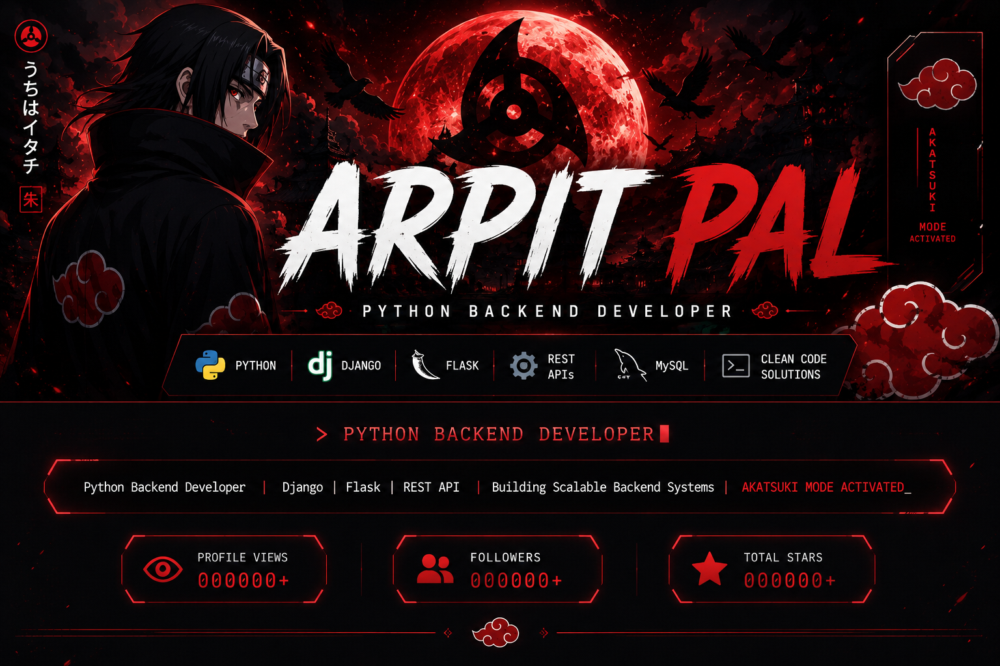
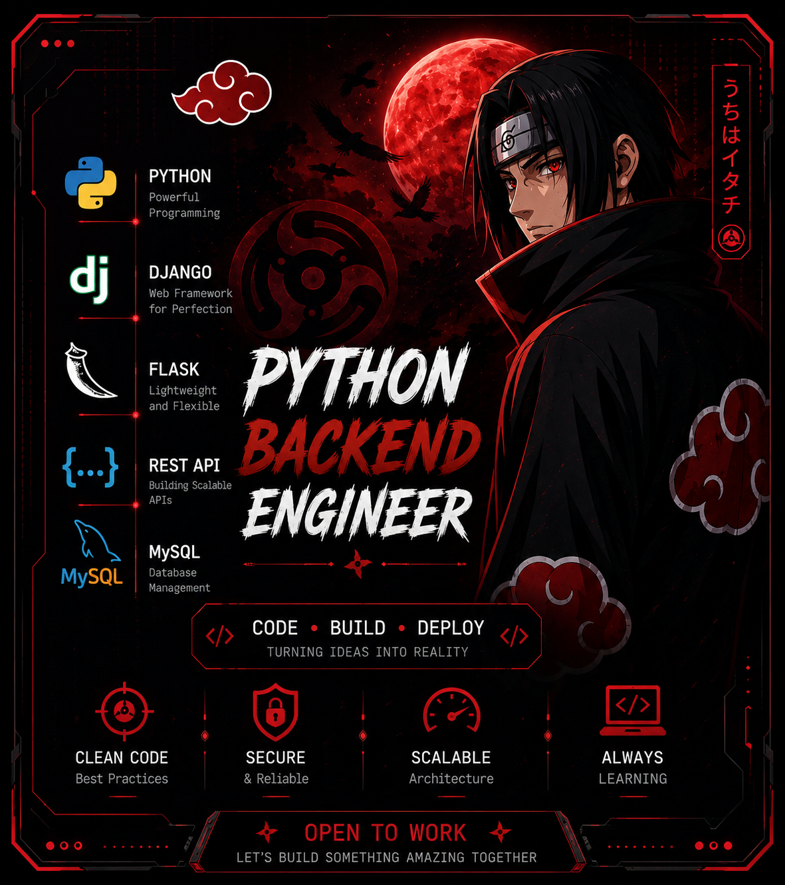
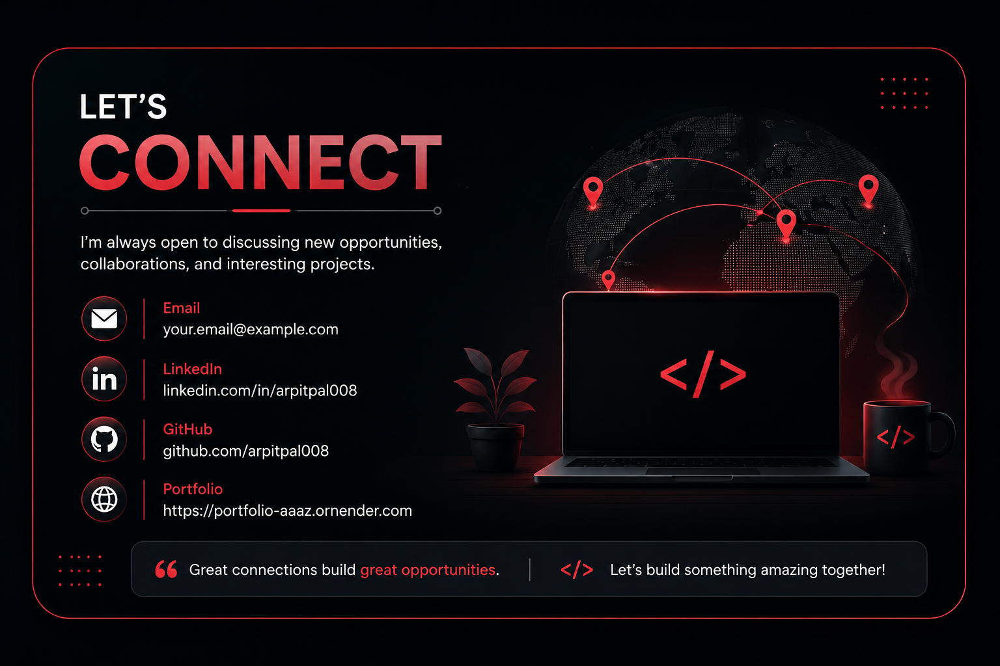

# Hi, I'm Arpit Pal 👋

### Python Backend Developer | Django | Flask | REST APIs

Building scalable backend applications with clean code and practical solutions.

---

# 👨‍💻 About Me

I'm a passionate **Python Backend Developer** who enjoys building scalable backend applications using **Django** and **Flask**.

I enjoy solving real-world problems through clean architecture, database design, and efficient backend development.

Currently, I'm focused on building practical projects, strengthening my backend skills, and preparing for Software Developer opportunities.

---

# 🚀 Tech Stack

---

# 📌 Featured Projects

## 📚 Library Management System

**Python • Django • SQLite • Bootstrap**

A complete library management system featuring authentication, book management, issue & return functionality, and CRUD operations.

### Features

- 🔐 User Authentication
- 📚 Book Management
- 🔄 Issue & Return System
- ✏️ CRUD Operations
- 📱 Responsive Interface

🌐 **Live Demo**

https://library-management-system-django-yx8r.onrender.com/

---

## 🤖 AI Voice Assistant

**Python • Gemini AI • Speech Recognition**

A desktop voice assistant capable of performing voice commands, AI conversations, text-to-speech, and web search.

### Features

- 🎙 Voice Commands
- 🤖 AI Chat
- 🔊 Text-to-Speech
- 🌐 Web Search
- ⚡ Automation

---

## ✅ Flask Todo App

**Flask • SQLite • SQLAlchemy**

A lightweight task management application built to understand Flask, SQLAlchemy ORM, and CRUD operations.

### Features

- ➕ Add Tasks
- ✏️ Update Tasks
- ❌ Delete Tasks
- 💾 SQLite Database

---

## 🎵 Spotify Clone

**HTML • CSS • JavaScript**

A responsive Spotify-inspired music player interface with modern frontend design.

### Features

- 🎵 Music Player UI
- 📱 Responsive Layout
- ✨ Interactive Design

---

# 📊 GitHub Statistics

---

# 🌱 Currently Learning

- Django REST Framework (DRF)
- Docker
- REST API Development
- Authentication & Authorization
- Backend Optimization
- Data Structures & Algorithms

---

# 🎯 Career Goals

- 🚀 Build production-ready Django applications
- 🌍 Contribute to Open Source
- ⚙️ Learn System Design fundamentals
- 🔗 Master REST API Development
- 💼 Start my career as a Python Backend Developer

---

# 🤝 Let's Connect

  

---

## ⭐ Thanks for Visiting!

**"Code. Learn. Build. Repeat." 🚀**

